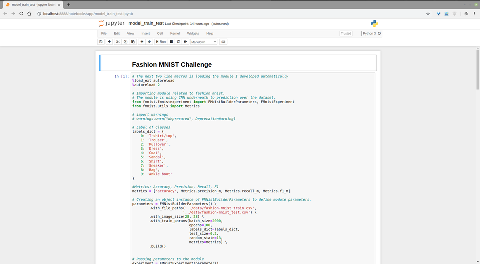
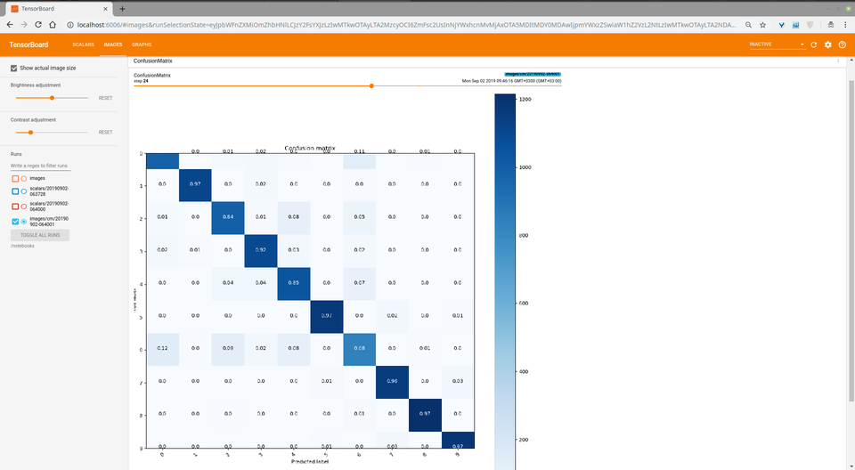
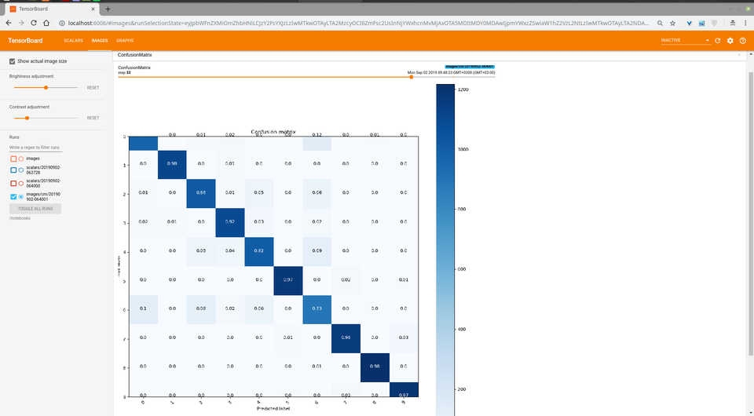
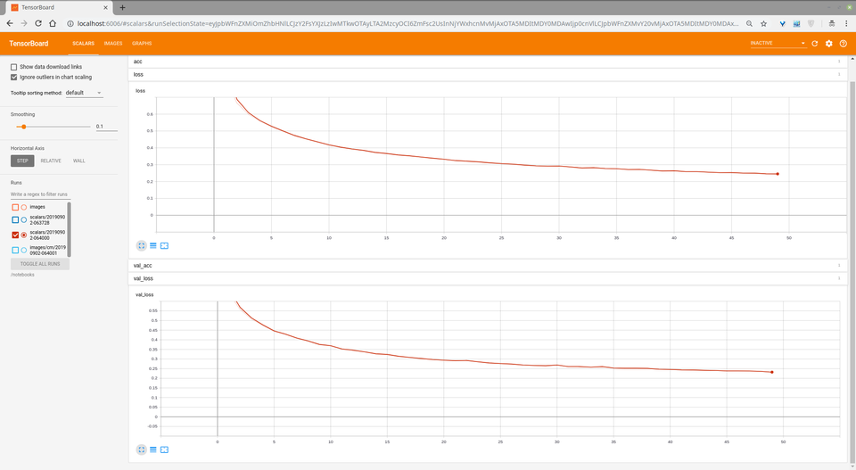
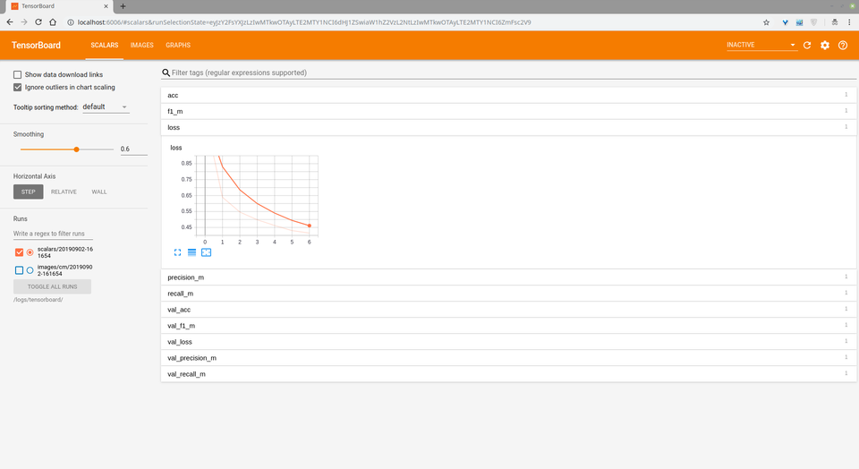
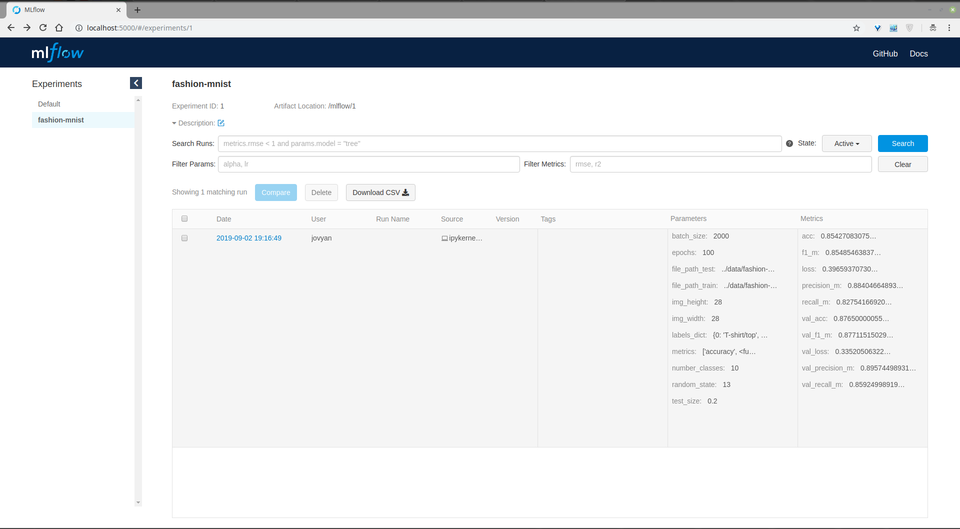
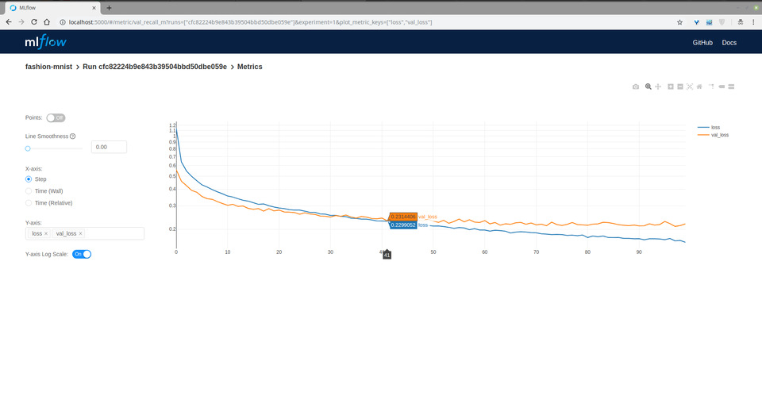
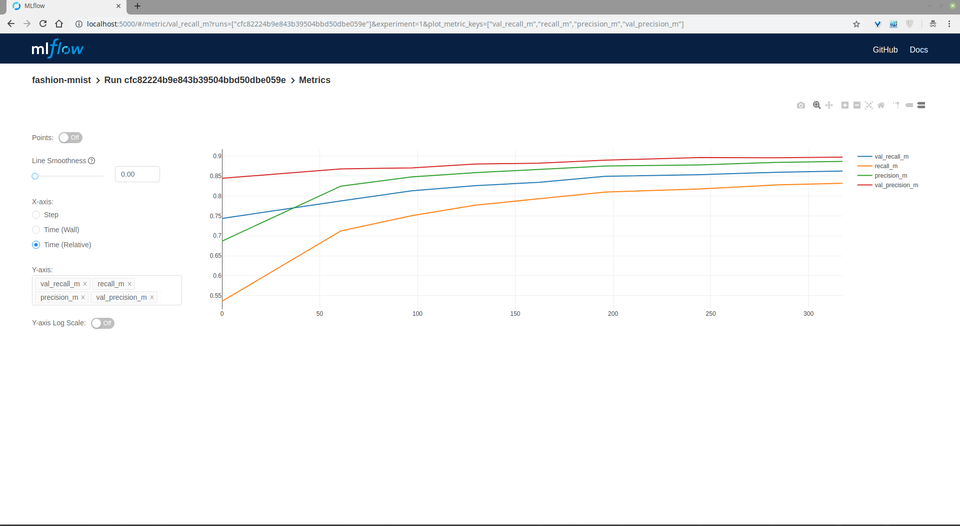
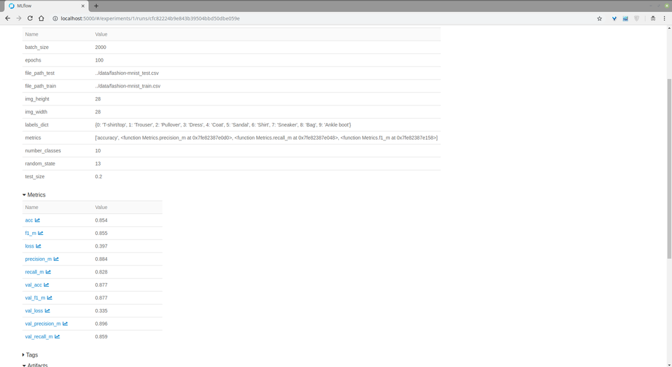
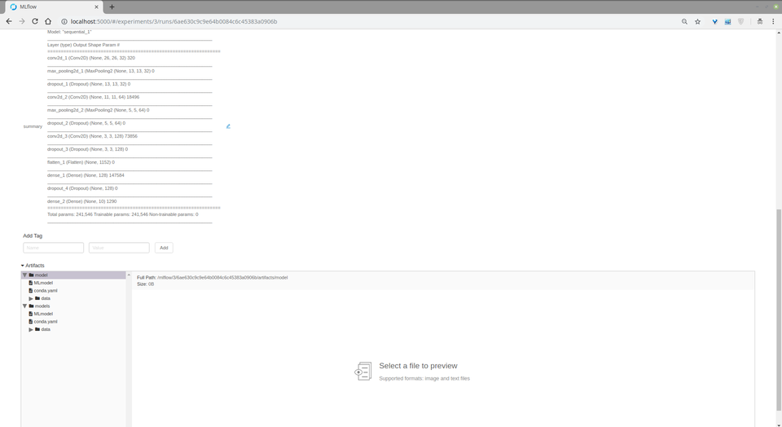

# Fashion MNIST as a Service on Docker

In this case, we used docker container technologies to create ML platform from scratch.
It is consists of four different docker containers (mlflow, notebook, postgres, tensorboard) that are already built in `docker-compose.yml`

The details of containers could be found under `./platform` directory.
Each container service has a specific dockerfile corresponding to the directories (mlflow, notebook, postgres, tensorboard) 
under platform directory

# ML Model
We built CNN network to train dataset with four different metrics (accuracy, precision, recall, f1)
We are logging those metrics mlflow and tensorboard sides. In addition, we plotted confusion matrix on tensorboard side rather than notebook.

# Docker Services

### Notebook
This service handles client side request via internet browser. We created a module (`fmnist`) for training and testing. 
Whenever we changed any codes in the module, Notebook are loading that module automatically macros in the first cell on the notebook.

### Tensorflow for TensorBoard
This service is being used to keep track confusion matrix and metrics' history of mode with respect to epoch. 
You may see the screenshots for TensorBoard, below.

### MLflow and Postgres
This service is being used to keep track and manage model parameters, metrics, model artifacts.
Postgres database is a database that is storing MLflow logs related to parameters, metrics.
Model artifacts is stored local disk. To manage flexibly storage, another options (S3, NFS etc.) could be used rather than local disk.
However, we preferred local disk in this implementation.

